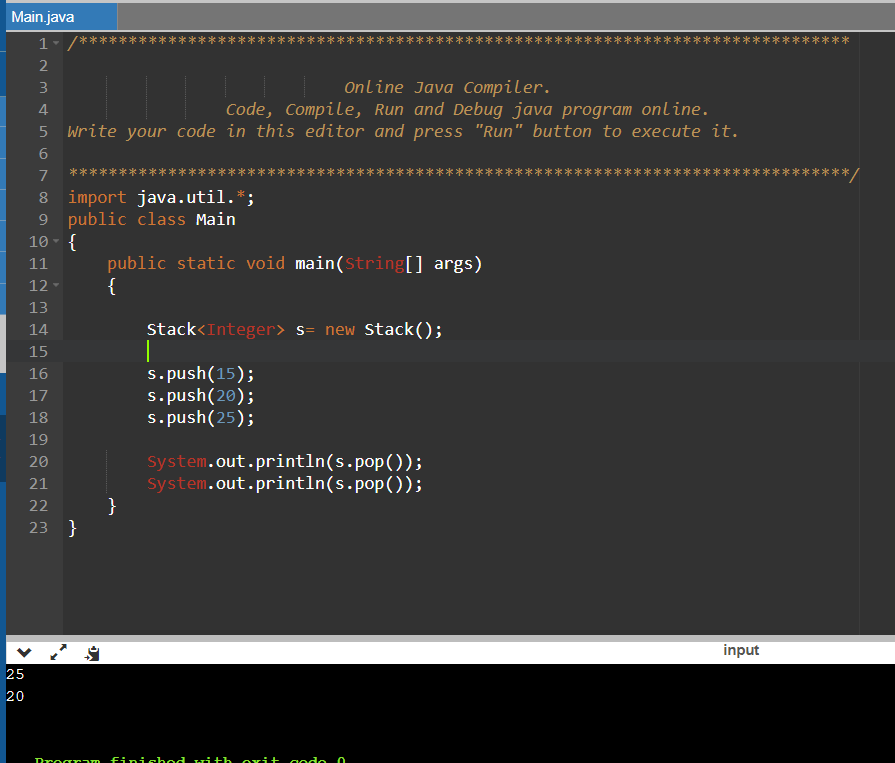
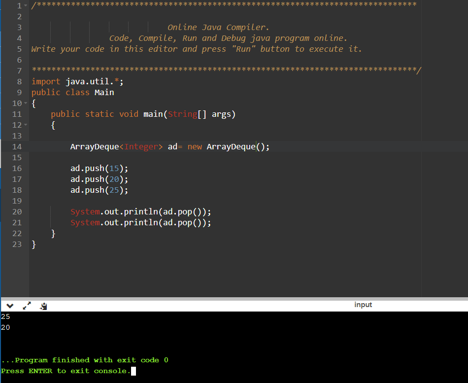

For saving our time, we must opt for ArrayDeque rather than stack. This is beacuse, as stack comes from the vecroe class, its all functions are thread safe.
Hence, there is overhead on some functions to acquire lock.

ArrayDeque does not have this threading feature as it does not come from vectors. Hence, it is less time consuming and more efficient.

